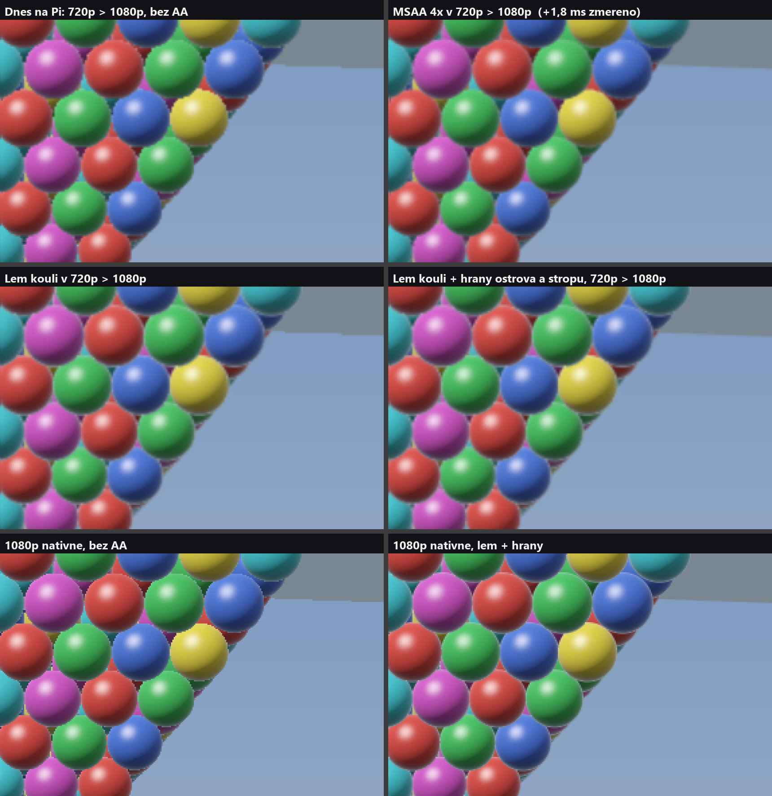
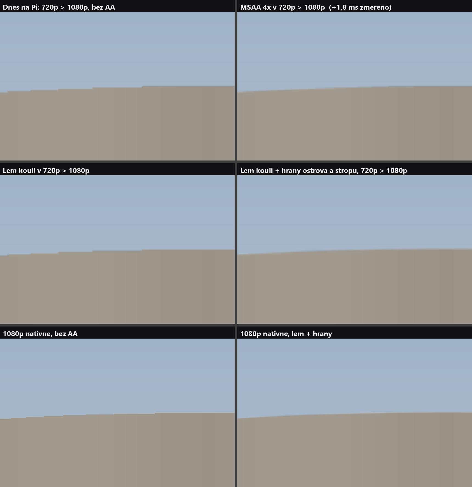

# Edge anti-aliasing for the Pi's Potato path — a design, not yet built

Written 2026-10-05 on the desktop for the session porting the game to the Raspberry Pi 5 (#785, #801). The owner: the
jagged edges are the port's worst eyesore, FXAA was tried, and "we should be able to use something pregenerated — be
original". **Nothing here has been measured on the Pi.** What is measured is quoted from #801; what is read from Mesa's
source says so; the pictures are a numpy simulation (`aa_sim.py`), not the game.

## What is known

- Measured on the Pi (#801): FXAA at the 1080p output **+3.3–3.8 ms**; MSAA 4× on the 720p scene target **+1.8 ms**;
  the 720p frame is 14.2 ms (Pennant) to 16.5–16.7 (Cabinet) against 16.7. Neither fits on Cabinet.
- **Read in Mesa's V3D driver** (`src/gallium/drivers/v3d`, main, 2026-10-05):
  - only 4× exists (`v3d_screen.c`: a sample count other than `V3D_MAX_SAMPLES` is refused), so there is no 2× to try;
  - a resolve blit of a whole target takes `v3d_tlb_blit_fast` (`v3d_blit.c`), which resolves straight out of the tile
    buffer — **but only if the colour buffer is still marked to be stored**, and `v3d_rcl_emit_stores` then writes
    **both** the resolved image and the raw 4× colour buffer (14.7 MB a frame at 720p). An application cannot remove that;
  - the fast path **submits the job at the blit**, so a `glInvalidateFramebuffer` of the multisampled **depth** has to
    come *before* the resolve blit; after it, another 14.7 MB is written. Worth checking where `TargetDiscard` sat when
    the +1.8 ms was measured: if after, MSAA may be cheaper than it read.
- Why a post-process filter is the wrong tool on this GPU: FXAA, SMAA, FSR and every temporal method are full-screen
  passes with many texture reads per pixel, and they guess where the edges are from colours. Potato has no shading
  detail to alias — no patterns, no relief, no shadows — only **geometric edges**, and where those are is known exactly.
  DLSS and frame generation need a neural accelerator and motion vectors, and they are upscalers, which is not the fault.

## 1. A rim for every ball (the core)

A ball is a sphere, so its outline is a formula. Draw each ball as now (opaque, nearest first, no `clip()`), then, after
**everything opaque including the sky**, draw one thin ring per ball over its outline: alpha-blended, depth-tested,
**no depth write**. The ring carries the ball's own colour at its limb and an alpha that falls from 1 on the outline to
0 one pixel outside it — exact coverage, blended against whatever is really behind. On a tile-based GPU a blend costs
no extra memory traffic, and the cost is only the edge pixels: no full-screen pass.

This is "discontinuity edge overdraw" (Sander, Hoppe, Snyder, Gortler, 2001), out of use since MSAA became cheap on
desktop cards. What makes it nearly free here is that no silhouette has to be searched for.

Vertex shader, per instance, over a strip of ~24 segments whose vertices carry `(cos t, sin t, side)`:

```
C = the instance's centre;  R = its radius (0.5 x the world scale x GhostScale)
toEye = EyePosition - C;  d = length(toEye);  v = toEye / d
Cs = C + v * (R*R/d)                    // the limb circle of a sphere seen from the eye: nearer by R^2/d ...
rs = R * sqrt(1 - R*R/(d*d))            // ... and this much smaller
u = normalize(cross(v, up));  w = cross(v, u)
P = Cs + rs * (cos t * u + sin t * w)   // a point ON the sphere, on its outline
N = (P - C) / R                         // its normal, perpendicular to the view ray
colour = the ball's shading at (P, N), through ToDisplay, at the vertex
position = project(P), moved on screen along the outline's radial direction by `side` pixels
alpha = 1 - side                        // side runs from -1 (inside) to +1 (outside); the pixel shader saturates it
```

- The strip runs from one pixel inside (alpha clamps to 1, covering the gap an inscribed LOD mesh leaves) to one pixel
  outside. The pixel shader is `return float4(colour, saturate(alpha))`.
- `BlendState.NonPremultiplied`, depth test on, depth write off, a small depth bias towards the eye so a ball's own
  mesh does not fight its ring. A nearer ball still hides the ring.
- The ball grows by half a pixel. Order does not matter beyond the few pixels where two rings cross.
- **It needs its own instance stream.** The balls are drawn per type and LOD, each bucket uploaded with `Discard` and its
  colour a uniform, and the rings must come after the sky — so collect a compact stream while the buckets are filled
  (centre and radius, tint, occlusion) and draw every ring in **one** call.
- Dithered balls get no ring. A launch argument switches it, so it can be A/B'd the way #801's table was measured.

## 2. Fins for the few long edges

The second picture is why this is not optional: the island's rim against the sky is one long, nearly horizontal edge,
where the staircase is worst. The same idea, pregenerated: for the island, the drain, the ceiling plate (later the gun),
build **once at load** a strip along every edge that can be an outline — a lathe's profile rings, a plate's border. Each
vertex carries the edge's two face normals; the vertex shader collapses the strip where the edge is not an outline from
this eye and otherwise pushes it one pixel out on screen with the same alpha ramp. Static buffers, one draw a mesh.

## 3. Buying the budget back

Rims at 720p remove the staircase but the picture is still scaled up 1.5 times. The prize is native 1080p, 3 ms away.

- **Per-ball work is done per pixel in `BallPS`**: `SrgbToLinear(PatternPrimaryColor)` (three `pow`), `Heartbeat` (two
  `exp`), the peak, the lava branch, the ripple. Compute it in `PotatoBallVS` and pass it down.
- **Measure the ceiling first**: a debug technique whose ball pixel shader returns a flat colour says how many
  milliseconds the balls' shading is worth at 1080p. Under a millisecond, stop here.
- If more: **a pre-shaded sphere**. With directional lights every ball is the same lit sphere but for its tint, its
  occlusion and its place. Render that lighting once a frame into a 64x64 octahedral map indexed by the world normal,
  and a ball's pixel becomes one texture read times its tint. Specular and Fresnel are evaluated for the view direction
  at the cluster's centre; at the frame's edge the highlight is off by about ten degrees of normal.

## The simulation

`python aa_sim.py .` writes the two sheets: a cluster on the BS3D lattice (balls ~12 px in radius at 720p), a ceiling
edge and an island rim, rasterised as a GPU would and scaled 720p to 1080p bilinearly as `PotatoUpscale` does; MSAA is
four rotated-grid samples resolved in display space; the rims are blended nearest-first, the worst order.




## Order of work

1. Check the MSAA depth invalidate's position; re-measure MSAA 4x if it moved. It is the baseline to beat.
2. Ball rims behind a launch argument; measure on Pennant, Girandole, Cabinet; photograph.
3. Fins for the island and the ceiling.
4. The flat-colour measurement, then per-ball work at the vertex, then the pre-shaded sphere if it pays.
